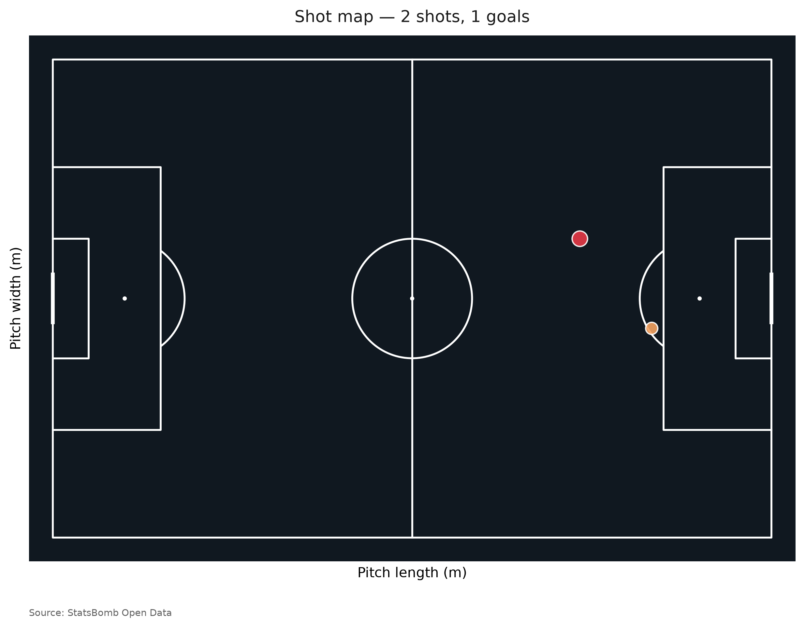

# lionelmessi

[](https://github.com/lionelmessi/lionelmessi/actions/workflows/ci.yml)
[](https://pypi.org/project/lionelmessi/)
[](https://pypi.org/project/lionelmessi/)
[](LICENSE)

**Scientific football analytics engine for Lionel Messi's career.** `lionelmessi`
ingests [StatsBomb Open Data](https://github.com/statsbomb/open-data) and
delivers pitch-level spatial analytics, Expected Threat (xT) and VAEP-style
action values, possession-chain analysis, goal and assist breakdowns, and
publication-quality visualizations.



## Install

```bash
pip install lionelmessi            # core
pip install "lionelmessi[viz,ml]"  # + mplsoccer/seaborn and scikit-learn
```

Requires Python ≥ 3.10.

## 30-second quickstart

```python
import lionelmessi as lm

# Fetch and cache every Messi match (first run hits the network; later runs are offline)
events = lm.load_events()

print(lm.career_summary(events))

# Fit an Expected Threat model on observed pass/carry transitions
xt = lm.ExpectedThreat().fit(events)
xt.plot(annotate=False).figure.savefig("xt.png", dpi=300)

# Possession chains ending in a goal
chains = lm.build_continuations(events, xt_model=xt)
big = lm.filter_continuations(chains, actor="Messi", min_xt_gain=0.05, ended_in_goal=True)
print(lm.continuation_summary(big).head())
```

Or from the command line:

```bash
lionelmessi fetch
lionelmessi summary
lionelmessi xt-fit --out xt.npz
lionelmessi xt-plot --model xt.npz --out xt.png
lionelmessi shotmap --season 2011/2012 --out shots.png
lionelmessi report --out report.html
```

## Features

| Area | What you get |
| --- | --- |
| **Data** | Cached, retried, parallel ingestion of StatsBomb Open Data; deterministic Parquet cache; offline after first fetch |
| **Metrics** | Career, seasonal, competition, and per-90 summaries; shot/assist maps; progressive actions; zone heatmaps; rolling form |
| **Models** | `ExpectedThreat` grid model fitted from observed transitions; optional VAEP-style classifier; simple pitch-control surface |
| **Chains** | Possession-chain construction with xT gain, xG, actors, and goal outcome |
| **Viz** | Pitch, xT surface, shot/goal/assist maps, pass map & network, carry map, heatmap, continuation and goal-breakdown plots, timelines |
| **Reports** | Match/season/career reports exported to self-contained HTML or PDF |

## Data & licensing

`lionelmessi` downloads the **StatsBomb Open Data** repository on demand and
caches it locally. It does not bundle or redistribute proprietary data. The open
data is free for non-commercial use; please review the StatsBomb Open Data
licence and user agreement before using the outputs.

> **Disclaimer.** This project is not affiliated with, endorsed by, or
> sponsored by Lionel Messi, FC Barcelona, Paris Saint-Germain, Inter Miami CF,
> or StatsBomb.

## Citation

```bibtex
@software{lionelmessi2026,
  title  = {lionelmessi: Scientific football analytics for Lionel Messi's career},
  author = {lionelmessi contributors},
  year   = {2026},
  url    = {https://github.com/lionelmessi/lionelmessi}
}
```

See [`CITATION.cff`](CITATION.cff) for the machine-readable version.

## Development

```bash
python -m venv .venv && . .venv/bin/activate
pip install -e ".[dev,viz,ml]"
ruff check src tests
mypy
pytest
```

## License

MIT — see [LICENSE](LICENSE).
